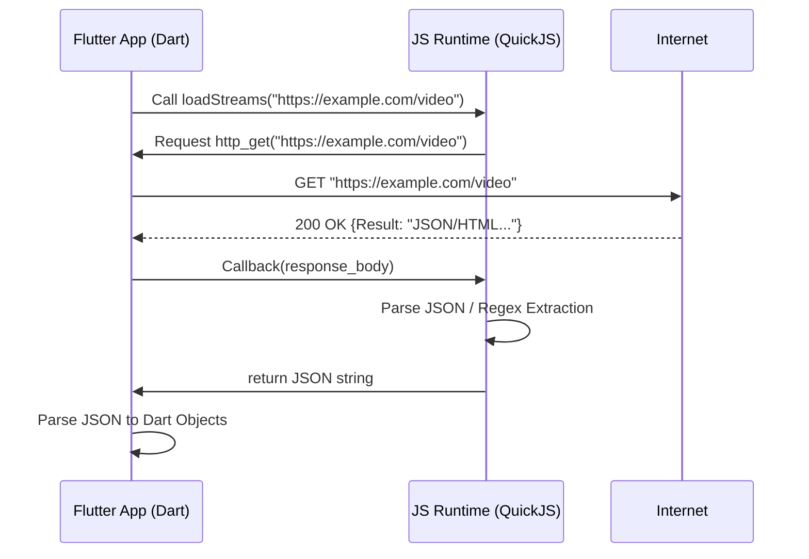

# Kotlin to JavaScript CloudStream Provider Migration Guide

**For use with SkyStream**

> **Note**: While CloudStream uses Kotlin for providers, SkyStream uses a **JavaScript Runtime** to execute providers dynamically across all platforms (iOS, Android, Desktop). This guide explains how to adapt concepts from existing Kotlin providers to the SkyStream JS format.

For a comprehensive guide on testing, packaging, and releasing your plugin, see the **[Plugin Development Guide](PLUGIN_DEVELOPMENT_GUIDE.md)**.

## 1. Overview & Architecture

### The Goal
To recreate the logic of a Kotlin class (e.g., `MyProvider.kt`) inside a JavaScript file (e.g., `myprovider.js`) that the Flutter CloudStream app can execute.

### Conceptual Mapping

| Feature | Kotlin (`CloudStreamProvider`) | JavaScript (`provider.js`) |
| :--- | :--- | :--- |
| **Manifest** | `name`, `mainUrl`, `supportedTypes` | `getManifest()` |
| **Home Page** | `getMainPage()` | `getHome(callback)` |
| **Search** | `search(query)` | `search(query, callback)` |
| **Details** | `load(url)` | `load(url, callback)` |
| **Streams** | `loadLinks(data)` | `loadStreams(url, callback)` |

---

## 2. The Bridge: How the App Decodes JS

The Flutter app (`js_engine.dart`) uses a **headless JavaScript Runtime** (QuickJS). It executes your JS functions and expects specific JSON returns.

**Detailed Flowchart:**



---

## 3. Step-by-Step Migration Guide

### Step 1: The Manifest
**Goal**: Identify the provider.
**Kotlin**: Class properties.
**JS Contract**:
```json
{
    "name": "Provider Name",
    "id": "com.example.provider", // Unique ID
    "version": 1,
    "baseUrl": "https://example.com",
    "categories": ["Movie"], // "Movie", "TvSeries", "Anime", "LiveTv"
    "languages": ["en"]
}
```

**Implementation**:
```javascript
function getManifest() {
    return {
        name: "My Provider",
        id: "com.example.myprovider",
        version: 1,
        baseUrl: "https://example.com",
        categories: ["Movie"],
        languages: ["en"]
    };
}
const mainUrl = "https://example.com";

/*
CRITICAL: The 'id' property is the PRIMARY KEY for your provider.
- It must be unique (e.g. com.example.myprovider).
- Do NOT change it after release, or users will lose their data/history for this provider.
*/
```

### Step 2: Authentication & Headers
**Goal**: mimic the app's browser behavior.
**Kotlin**: Often uses `interceptor` or overrides `headers`.
**JS Implementation**: Define a global `commonHeaders` object.
```javascript
const commonHeaders = {
    "User-Agent": "Mozilla/5.0 (Windows NT 10.0; Win64; x64) AppleWebKit/537.36...",
    "Referer": mainUrl + "/"
};
```

### Step 3: Getting the Home Page
**Goal**: Fetch categories (Trending, Latest) and their content.

**Kotlin**: `getMainPage()` returns `List<HomePageResponse>`.
**JS Contract**:
```json
[
    {
        "title": "Trending",
        "Data": [
            {
                "name": "Movie Title",
                "link": "https://example.com/movie/123", // Absolute URL
                "image": "https://example.com/poster.jpg",
                "description": "Optional info"
            }
        ]
    }
]
```

**Implementation Strategy**:
Since JS `http_get` is async, use a counter or recursion if you need to fetch multiple categories.

```javascript
function getHome(callback) {
    var inputs = [
        { title: "Trending", url: mainUrl + "/trending" },
        { title: "Latest", url: mainUrl + "/latest" }
    ];
    
    var finalResult = [];
    var pending = inputs.length;

    inputs.forEach(item => {
        http_get(item.url, commonHeaders, (status, data) => {
             // PARSE LOGIC (Regex or JSON)
             // var movies = ...
             
             finalResult.push({ title: item.title, Data: movies });
             
             pending--;
             if (pending === 0) {
                 callback(JSON.stringify(finalResult)); 
             }
        });
    });
}
```

### Step 4: Search
**Goal**: Search for content.
**Kotlin**: `search(query)`.
**JS Contract**: Same as `getHome` (List of Sections).

```javascript
function search(query, callback) {
    var searchUrl = mainUrl + "/search?q=" + encodeURIComponent(query);
    http_get(searchUrl, commonHeaders, (status, data) => {
        // PARSE LOGIC
        // callback(JSON.stringify([{ title: "Search", Data: movies }]));
    });
}
```

### Step 5: Load Details (Metadata)
**Goal**: Get full movie details and prepare for streaming.
**Kotlin**: `load(url)`.

**JS Contract**:
```json
{
    "url": "https://original-url.com", // Pass-through ID
    "data": "arbitrary_string_data",   // DATA TO PASS TO loadStreams (Critical!)
    "title": "Movie Title",
    "description": "Plot summary...",
    "year": 2023,
    "subtitle": "Optional subtitle"
}
```

**Logic**:
Sometimes the page you load contains the *real* stream data in a hidden JSON or variable. You can extract that here and pass it via the `data` field to `loadStreams`.

```javascript
function load(url, callback) {
    http_get(url, commonHeaders, (status, html) => {
        // 1. Extract Metadata
        var title = ...;
        var plot = ...;
        
        // 2. Extract Data for Streaming
        // Example: The site has a hidden "video_id" needed to play.
        // var data = "video_id=12345";
        
        callback(JSON.stringify({
            url: url,
            data: html, // Or extracted ID. Passing full HTML is okay if < 1MB.
            title: title,
            description: plot
        }));
    });
}
```

### Step 6: Stream Extraction
**Goal**: Return playable links.
**Kotlin**: `loadLinks(data)`.

**JS Contract**:
```json
[
    {
        "name": "1080p - Server 1",
        "url": "https://link.to/video.mp4",
        "headers": { "User-Agent": "..." }, // CRITICAL for playback
        "subtitles": [
            { "label": "English", "url": "https://...vtt" }
        ] 
    }
]
```

**Implementation**:
Use the `url` (original URL) or `data` (passed from `load`) to find the stream.

```javascript
function loadStreams(url, callback) {
    // 1. Use the 'data' passed from load() if possibly, or fetch 'url' again.
    // NOTE: In the JS Engine, currently 'loadStreams' receives the raw 'url'. 
    // If you need the 'data' from step 5, you might need to re-fetch or rely on the url.
    
    http_get(url, commonHeaders, (status, data) => {
        // PARSE STREAMS
        var streams = [];
        // ... conversion logic ...
        
        // Always attach headers!
        streams.forEach(s => s.headers = commonHeaders);
        
        callback(JSON.stringify(streams));
    });
}
```

### 📋 Useful Cheat Sheet: Common Regex Patterns
Since DOM parsing is missing, use these patterns to extract data from HTML string variables:

| Goal | Pattern | Usage |
| :--- | :--- | :--- |
| **Extract HREF** | `href="([^"]+)"` | `regex.exec(html)[1]` |
| **Extract Image** | `src="([^"]+\.(jpg\|png))"` | `regex.exec(html)[1]` |
| **Extract Variable** | `var\s+stream\s*=\s*"([^"]+)"` | Finding hidden stream links in `<script>` |
| **Extract Between Tags** | `<div class="title">([^<]+)</div>` | Getting titles/text |


---

## 4. Troubleshooting & Debugging Checklist

When the JS provider fails but Kotlin works:

1.  **URL Mismatch**: Is JS fetching `mainUrl + "/mm.json"` while Kotlin fetches `mainUrl + "/ml.json"`? Print the URLs!
2.  **Header Mismatch**: Are `cf-access` headers attached? The player needs them too, not just the extractor.
3.  **Hidden JSONs**: Does the response contain a key like `l` or `source` that points to *another* JSON file?
4.  **Async/Timing**: Did the JS function return before the `http_get` callback finished? (Common bug: ensure `callback()` is called inside the network success block).
5.  **Data Types**: JS is loosely typed. "1" (string) vs 1 (int). Ensure IDs match.

## 5. Summary of RingZ Fixes

1.  **Extraction Logic**: Kotlin was fetching a secondary JSON (`data.l`) for streams. JS was trying to parse the metadata JSON. **Fix**: Replicated the second fetch loop in JS.
2.  **Link Filtering**: JS was counting "TRUE/FALSE" config flags as video links. **Fix**: Added explicit value exclusion.
3.  **Header Propagation**: The video player was getting 403s. **Fix**: Passed `commonHeaders` explicitly in the final `Stream` object returned to the app.

---

## 6. Constraints & Limitations

When writing JavaScript providers for CloudStream, you are **NOT** running in a full Node.js environment or a Web Browser. You are in a embedded **QuickJS** sandbox.

### 🚫 No DOM Access
*   **Constraint**: Objects like `window`, `document`, `navigator`, or `localstorage` DO NOT EXIST.
*   **Implication**: You cannot use libraries that rely on DOM manipulation (like jQuery). You must use **Regex** or string parsing to extract data from HTML. Even `cheerio` is not available unless you bundle it (which is difficult).

### 📦 No `npm` or `require()`
*   **Constraint**: You cannot install external packages. The provider must be a **single, standalone `.js` file**.
*   **Implication**: Any helper logic (CryptoJS, HTML entities decoding) must be physically pasted into your `.js` file or implemented from scratch.

### ⚡ Async/Await vs Callbacks
*   **Constraint**: While QuickJS supports Promises, the specific *bridge* implementation in CloudStream often relies on strictly sequenced **CS-Callbacks**.
*   **Recommendation**: Stick to the callback pattern (`http_get(url, headers, cb)`) rather than trying to wrap everything in `async/await`. It prevents "Unhandled Promise Rejection" errors that are hard to debug in the embedded engine.

### 🔒 Encryption & Cryptography
*   **Constraint**: Native `crypto` module is missing.
*   **Implication**: If a site uses complex AES decryption / WASM obfuscation to hide links, it is extremely difficult to port to JS. You may need to inject a pure-JS AES implementation (like `crypto-js.min.js` source) directly into your file.

### 🧵 Single Threaded
*   **Constraint**: The JS Engine blocks the UI thread if you run massive parsing loops.
*   **Best Practice**: Keep parsing logic efficient. Avoid deeply nested loops over thousands of items.

### 🌐 CORS Does Not Apply
*   **Advantage**: Unlike a browser, you suffer no CORS (Cross-Origin Resource Sharing) limitations. You can request any URL, including `Referer` headers that would normally be blocked.
